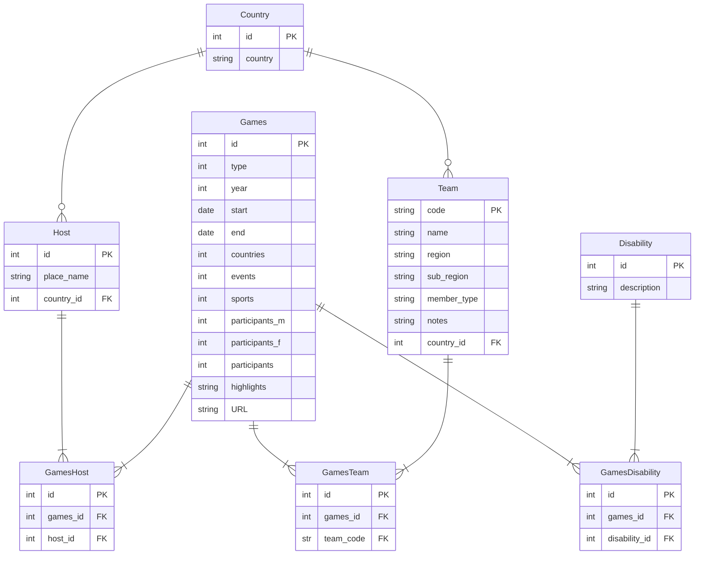

```mermaid
erDiagram
    Games {
        int id PK
        int type
        int year
        date start
        date end
        int countries
        int events
        int sports
        int participants_m
        int participants_f
        int participants
        string highlights
        string URL
    }
    Team {
        string code PK
        string name
        string region
        string sub_region
        string member_type
        string notes
        int country_id FK
    }
    Host {
        int id PK
        string place_name
        int country_id FK
    }
    Disability {
        int id PK
        string description
    }
    Country {
        int id PK
        string country
    }
    GamesTeam {
        int id PK
        int games_id FK
        str team_code FK
    }
    GamesDisability {
        int id PK
        int games_id FK
        int disability_id FK
    }
    GamesHost {
        int id PK
        int games_id FK
        int host_id FK
    }
    Games ||--|{ GamesTeam: ""
    Team ||--|{ GamesTeam: ""
    Games ||--|{ GamesDisability: ""
    Disability ||--|{ GamesDisability: ""
    
    Host ||--|{ GamesHost: ""
    Games ||--|{ GamesHost: ""
    Country ||--o{ Host: ""
    Country ||--o{ Team: ""
```