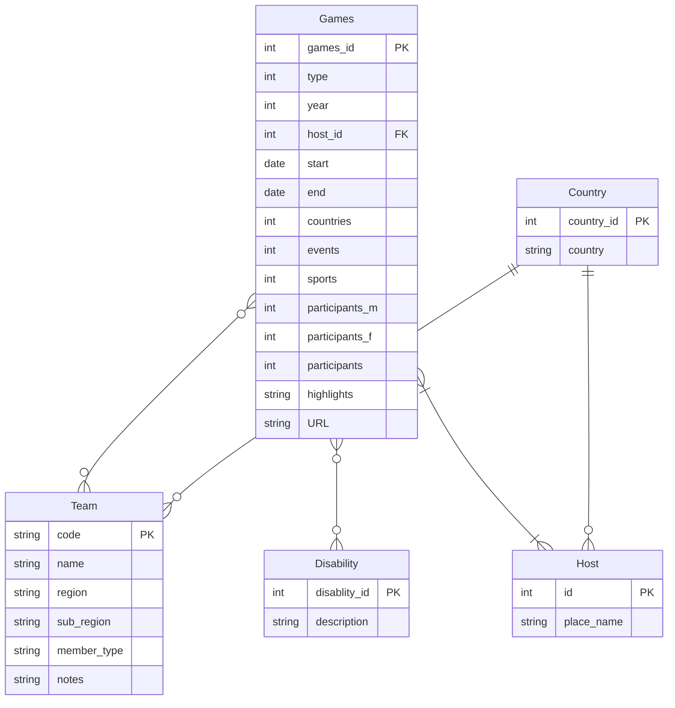

```mermaid
erDiagram
    Games {
        int games_id PK
        int type
        int year
        int host_id FK
        date start
        date end
        int countries
        int events
        int sports
        int participants_m
        int participants_f
        int participants
        string highlights
        string URL
    }
    Disability {
        int disablity_id PK
        string description
    }
    Team {
        string code PK
        string name
        string region
        string sub_region
        string member_type
        string notes
    }
    Host {
        int id PK
        string place_name
    }
    Country {
        int country_id PK
        string country
    }
    Games }o--o{ Team: ""
    Games }o--o{ Disability: ""
    Games }|--|{ Host: ""
    Country ||--o{ Host: ""
    Country ||--o{ Team: ""
```