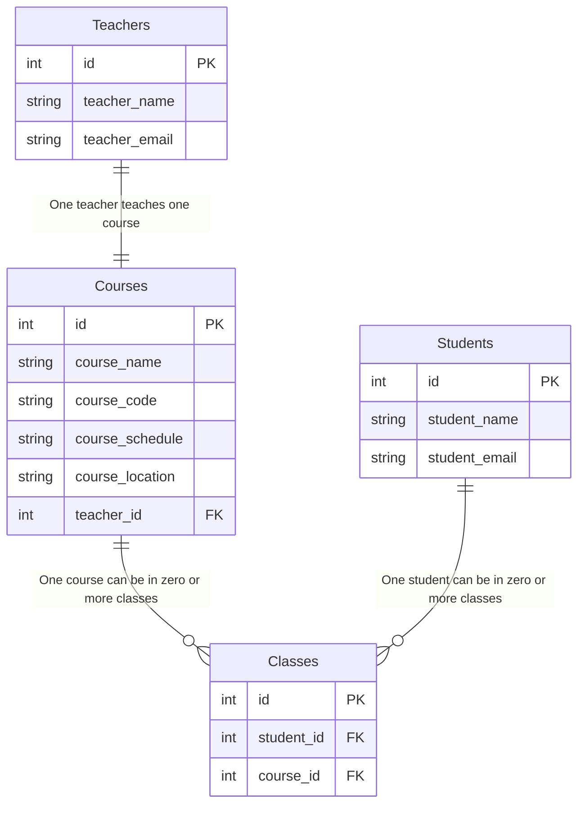

```mermaid
    erDiagram
        Teachers{
            int id PK
            string teacher_name
            string teacher_email
        }

        Students{
            int id PK
            string student_name
            string student_email
        }

        Courses{
            int id PK
            string course_name
            string course_code
            string course_schedule
            string course_location
            int teacher_id FK
        }

        Classes{
            int id PK
            int student_id FK
            int course_id FK
        }

        Teachers ||--|| Courses: "One teacher teaches one course"
        Courses ||--o{ Classes: "One course can be in zero or more classes"
        Students ||--o{ Classes: "One student can be in zero or more classes"
```