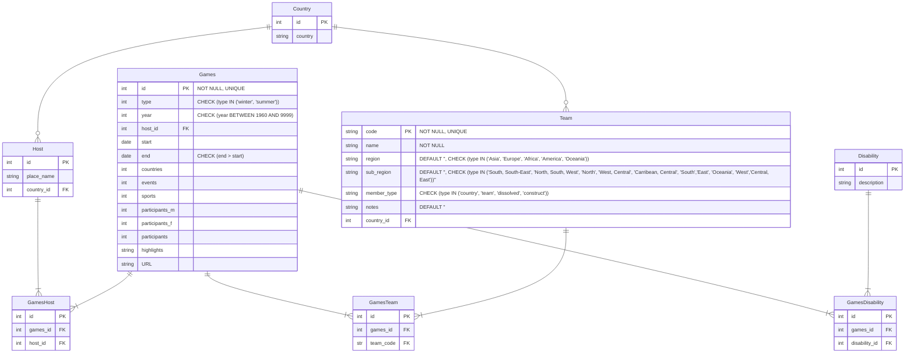

```mermaid
erDiagram
    Games {
        int id PK "NOT NULL, UNIQUE"
        int type "CHECK (type IN ('winter', 'summer'))"
        int year "CHECK (year BETWEEN 1960 AND 9999)"
        int host_id FK
        date start
        date end "CHECK (end > start)"
        int countries
        int events
        int sports
        int participants_m
        int participants_f
        int participants
        string highlights
        string URL
    }
    Team {
        string code PK "NOT NULL, UNIQUE"
        string name "NOT NULL"
        string region "DEFAULT '', CHECK (type IN ('Asia', 'Europe', 'Africa', 'America', 'Oceania'))"
        string sub_region "DEFAULT '', CHECK (type IN ('South, South-East', 'North, South, West', 'North', 'West, Central', 'Carribean, Central', 'South','East', 'Oceania', 'West','Central, East'))''"
        string member_type "CHECK (type IN ('country', 'team', 'dissolved', 'construct'))"
        string notes "DEFAULT ''"
        int country_id FK
    }
    Host {
        int id PK
        string place_name
        int country_id FK
    }
    Disability {
        int id PK
        string description
    }
    Country {
        int id PK
        string country
    }
    GamesTeam {
        int id PK
        int games_id FK
        str team_code FK
    }
    GamesDisability {
        int id PK
        int games_id FK
        int disability_id FK
    }
    GamesHost {
        int id PK
        int games_id FK
        int host_id FK
    }
    Games ||--|{ GamesTeam: ""
    Team ||--|{ GamesTeam: ""
    Games ||--|{ GamesDisability: ""
    Disability ||--|{ GamesDisability: ""
    Host ||--|{ GamesHost: ""
    Games ||--|{ GamesHost: ""
    Country ||--o{ Host: ""
    Country ||--o{ Team: ""
```