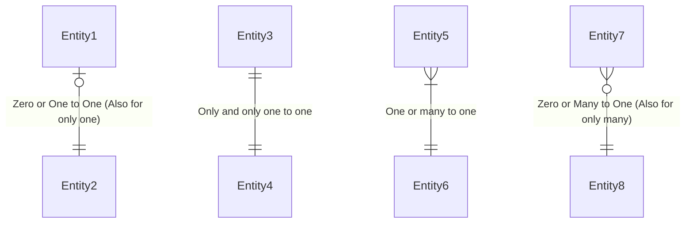

```mermaid
erDiagram
    Entity1 o|--|| Entity2 : "Zero or One to One (Also for only one)"

    Entity3 ||--|| Entity4 : "Only and only one to one"

    Entity5 }|--|| Entity6 : "One or many to one"

    Entity7 }o--|| Entity8 : "Zero or Many to One (Also for only many)"
```